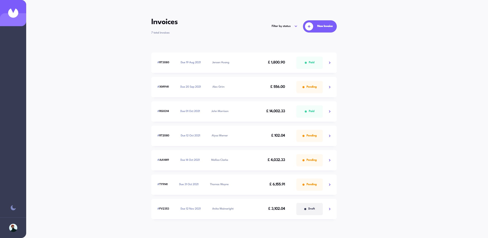

# Frontend Mentor - Invoice app solution

This is a solution to the [Invoice app challenge on Frontend Mentor](https://www.frontendmentor.io/challenges/invoice-app-i7KaLTQjl). Frontend Mentor challenges help you improve your coding skills by building realistic projects.

## Table of contents

- [Overview](#overview)
   - [The challenge](#the-challenge)
   - [Screenshot](#screenshot)
   - [Links](#links)

- [My process](#my-process)
   - [Built with](#built-with)
   - [What I learned](#what-i-learned)
   - [Useful resources](#useful-resources)

- [Author](#author)

## Overview

### The challenge

Users should be able to:

- View the optimal layout for the app depending on their device's screen size
- See hover states for all interactive elements on the page
- Create, read, update, and delete invoices
- Receive form validations when trying to create/edit an invoice
- Save draft invoices, and mark pending invoices as paid
- Filter invoices by status (draft/pending/paid)
- Toggle light and dark mode
- **Bonus**: Keep track of any changes, even after refreshing the browser (`localStorage` could be used for this if you're not building out a full-stack app)

### Screenshot



### Links

- Solution URL [Add solution URL here](https://your-solution-url.com).
- Live Site URL [here](https://guarded-beyond-15043.herokuapp.com/).

## My process

### Built with

- Semantic HTML5 markup
- Flexbox
- CSS Grid
- Mobile-first workflow
- [Vite](https://vitejs.dev/) - Dev environment tooling
- [Typescript](https://www.typescriptlang.org/) - syntactic superset of JavaScript with static typing
- [React](https://reactjs.org/) - JS library
- [Styled Components](https://styled-components.com/) - CSS-in-JS library for styling
- [Redux](https://redux.js.org/) - App state container library for React
- [React Router](https://reactrouter.com/en/main) - Routing library for React
- [Framer Motion](https://www.framer.com/motion/) - React animation library
- [JSON Server](https://github.com/typicode/json-server) - fake REST API for front-end protyping/mocking
- [dayjs](https://day.js.org/) - JS library for working with dates

### What I learned

#### - Creating generic types

```ts
type EditItemPropertyPayload<T> = {
  index: number;
  newValue: T;
};
```

#### - Writing type assertions

```ts
export function assertNotUndefined<T>(data: T | undefined): asserts data is T {
  if (data === undefined) {
    throw new Error(`'undefined' was found unexpectedly`);
  }
}
```

#### - Typing React components props

```tsx
type Props = {
  severity: 'success' | 'error';
  closeFunc: () => void;
  autoClose?: boolean;
  children?: ReactNode;
};

const Alert: React.FC<Props> = ({
  severity,
  closeFunc,
  autoClose,
  children
}) => (
    ...
  );
```

#### - Redux usage with TypeScript

```ts
export type RootState = ReturnType<typeof store.getState>;
export type AppDispatch = typeof store.dispatch;
```

```ts
import { createSlice, PayloadAction } from '@reduxjs/toolkit';
import type { RootState } from './store';

export type ThemeMode = 'light' | 'dark';

export interface ThemeState {
  mode: ThemeMode;
};

const initialState: ThemeState = {
  mode: 'light',
};

export const themeSlice = createSlice({
  name: 'theme',
  initialState,
  reducers: {
    setThemeMode: (state: ThemeState, action: PayloadAction<ThemeMode>) => {
      state.mode = action.payload;
    }
  }
});

export const { setThemeMode } = themeSlice.actions;

export const selectThemeMode = (state: RootState) => state.theme.mode;

export default themeSlice.reducer;
```

#### - Creating async redux thunks with TypeScript

```ts
export type ChangeInvoiceDataArgs = {
  id: string;
  changedData: ChangedInvoiceData;
};

export const changeInvoiceData = createAsyncThunk(
  'invoices/changeInvoiceData',
  async (args: ChangeInvoiceDataArgs) => {
    const { id, changedData } = args;

    return fetch(`${api.url}/${api.endpoints.invoices}/${id}`, {
      method: 'PATCH',
      headers: {
        'Content-type': 'application/json',
      },
      body: JSON.stringify(changedData),
    }).then((res) => res.json());
  }
);
```

```ts
export const invoicesSlice = createSlice({
  name: 'invoices',
  initialState,
  reducers: {},
  extraReducers: (builder) => {
    builder.addCase(changeInvoiceData.pending, (state, action) => {
      state.dataChanging.active = true;
      state.dataChanging.error = false;
      state.dataChanging.success = false;
    }),
    builder.addCase(changeInvoiceData.fulfilled, (state, action) => {
      const { id } = action.meta.arg;

      const changedInvoiceIndex = state.data.findIndex(
        (invoice) => invoice.id === id
      );

      state.data[changedInvoiceIndex] = action.payload;
      state.dataChanging.active = false;
      state.dataChanging.error = false;
      state.dataChanging.success = true;
    }),
    builder.addCase(changeInvoiceData.rejected, (state, action) => {
      state.dataChanging.active = false;
      state.dataChanging.error = true;
      state.dataChanging.success = false;
    })
  }
```

#### - Using styled-components with TypeScript

```ts
import styled, { css, DefaultTheme } from 'styled-components';

type SkeletonProps = {
  theme: DefaultTheme;
  $height?: string;
  $width?: string;
};

const CardSkeleton = styled.div<SkeletonProps>(
  ({ theme, $height, $width }) => css`
    min-height: ${$height};
    width: ${$width};
    margin-bottom: 16px;
    border-radius: 8px;
    box-shadow: 0px 10px 10px -10px ${theme.colors.shadow.lighter};
    background-color: ${theme.colors.backgrounds.skeleton};
    overflow: hidden;
    ${pulseAnimation}
    transition:
      background-color ${theme.transitionDuration} ease-in-out,
      box-shadow ${theme.transitionDuration} ease-in-out;

    @media only screen and (min-width: ${theme.breakpoints.md}) {
      height: 80px;
    }

    ${pulseKeyframes}
  `
);
```

### Useful resources

- [Codecademy TypeScript course](https://www.codecademy.com/learn/learn-typescript) - This is a free TypeScript course which helped me understand the basics of TypeScript
- [Stackoverflow](https://stackoverflow.com/) - Of course I searched for solutions for some technical problems here :)

## Author

- Github - [p-kosinski](https://github.com/p-kosinski)
- Frontend Mentor - [@p-kosinski](https://www.frontendmentor.io/profile/p-kosinski)
